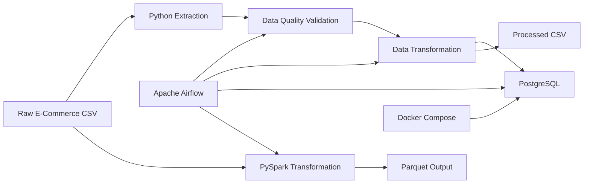

# E-Commerce Data Engineering Pipeline

An end-to-end data engineering project that processes raw e-commerce order data through data-quality validation, transformation, PostgreSQL storage, PySpark processing, and Apache Airflow orchestration.

The project demonstrates a production-style ETL workflow using Python, PostgreSQL, PySpark, Apache Airflow, Docker, SQL, and automated testing.

---

## Architecture



---

## Tech Stack

- Python 3
- Pandas
- PySpark
- Apache Airflow
- PostgreSQL
- Docker & Docker Compose
- SQL
- Pytest
- Git & GitHub

---

## Project Structure

```text
ecommerce-data-pipeline/
├── config/
├── dags/
│   └── ecommerce_etl_dag.py
├── data/
│   ├── raw/
│   │   └── orders.csv
│   └── processed/
│       └── orders_cleaned.csv
├── spark/
│   └── transform_orders.py
├── sql/
│   ├── analytics_queries.sql
│   └── schema.sql
├── src/
│   ├── data_quality.py
│   ├── extract.py
│   ├── load.py
│   ├── pipeline.py
│   └── transform.py
├── tests/
│   └── test_transform.py
├── .env.example
├── .gitignore
├── docker-compose.yml
├── requirements.txt
└── README.md
```

---

## Pipeline Workflow

### 1. Data Extraction

Raw e-commerce order records are extracted from:

```text
data/raw/orders.csv
```

The extraction layer validates that the source file exists before loading it into a Pandas DataFrame.

### 2. Data Quality Validation

The pipeline performs checks for:

- Missing required values
- Duplicate order IDs
- Invalid quantities
- Invalid unit prices
- Required columns

The sample dataset intentionally contains invalid records to demonstrate data-quality handling.

### 3. Data Transformation

The transformation layer:

- Removes duplicate orders
- Removes records with missing critical values
- Converts numeric columns safely
- Parses order dates
- Removes zero and negative quantities/prices
- Standardizes text fields
- Calculates `total_amount`
- Creates year, month, and day fields

The cleaned dataset is written to:

```text
data/processed/orders_cleaned.csv
```

### 4. PostgreSQL Load

Clean records are loaded into PostgreSQL.

The load process uses:

```sql
ON CONFLICT (order_id) DO UPDATE
```

This makes the database load idempotent, allowing the pipeline to be rerun without creating duplicate order records.

### 5. PySpark Processing

A separate PySpark transformation processes the raw dataset and writes the cleaned output in Parquet format.

This demonstrates distributed data-processing concepts in addition to the Pandas ETL implementation.

### 6. Apache Airflow Orchestration

Apache Airflow orchestrates the workflow with the following task dependency:

```text
validate_raw_data
        |
        v
run_etl_pipeline
        |
        v
run_pyspark_transformation
```

The DAG is configured for daily scheduling.

---

## Database Schema

The PostgreSQL `orders` table contains:

- `order_id`
- `customer_id`
- `product_id`
- `product_name`
- `category`
- `quantity`
- `unit_price`
- `order_date`
- `country`
- `total_amount`
- `order_year`
- `order_month`
- `order_day`
- `created_at`

Indexes are created for commonly queried fields including customer, category, and order date.

---

## SQL Analytics

The project includes analytical SQL queries for:

- Total orders
- Total units sold
- Total revenue
- Average order value
- Revenue by category
- Top-selling products
- Customer spending
- Monthly sales performance
- Country-level sales analysis

Queries are available in:

```text
sql/analytics_queries.sql
```

---

## Automated Testing

Transformation logic is tested using Pytest.

The test suite covers:

- Duplicate removal
- Missing customer handling
- Invalid quantity handling
- Invalid price handling
- Total amount calculation
- Date-column generation
- Text standardization

Run:

```bash
pytest -v
```

---

## Running with Docker

### 1. Configure environment variables

Create your local environment file:

```bash
cp .env.example .env
```

Update the database password in `.env`.

Example:

```env
DB_NAME=ecommerce_db
DB_USER=ecommerce_user
DB_PASSWORD=your_password
DB_HOST=localhost
DB_PORT=5433
```

The `.env` file is excluded from Git and should not be committed.

### 2. Start PostgreSQL

```bash
docker compose up -d
```

Check the container:

```bash
docker compose ps
```

PostgreSQL is exposed on host port `5433`.

### 3. Export variables for the Python ETL

```bash
export DB_NAME=ecommerce_db
export DB_USER=ecommerce_user
export DB_PASSWORD=your_password
export DB_HOST=localhost
export DB_PORT=5433
```

### 4. Run the ETL pipeline

```bash
python src/pipeline.py
```

---

## Run PySpark Transformation

```bash
python spark/transform_orders.py
```

The Spark job produces Parquet output under:

```text
data/spark_processed/orders/
```

Generated Spark output is excluded from version control.

---

## Apache Airflow

Airflow is maintained in a separate virtual environment from the main project dependencies.

After configuring Airflow, the DAG can be validated with:

```bash
airflow dags list
```

View its tasks with:

```bash
airflow tasks list ecommerce_data_pipeline --tree
```

For a local end-to-end DAG test:

```bash
airflow dags test ecommerce_data_pipeline 2026-08-31
```

The DAG executes data-quality validation, the ETL pipeline, and the PySpark transformation.

---

## Sample Pipeline Result

The included sample dataset contains:

```text
Raw records:      14
Clean records:    10
Rejected/removed: 4
```

The intentionally invalid records demonstrate handling of duplicate IDs, missing customer information, invalid quantities, and invalid prices.

---

## Key Engineering Concepts Demonstrated

- ETL pipeline design
- Data-quality validation
- Data cleaning and transformation
- Idempotent database loading
- PostgreSQL schema design
- SQL analytics
- PySpark data processing
- Parquet storage
- Airflow workflow orchestration
- Dockerized database infrastructure
- Environment-based configuration
- Automated unit testing

---

## Future Enhancements

Potential extensions include:

- AWS S3 integration
- Cloud deployment
- CI/CD pipeline
- Larger datasets for distributed Spark processing
- Airflow-based SQL analytics tasks
- Data-quality reporting and alerting

---

## License

This project is available under the repository's LICENSE file.
